# YANG数据模型

Description:本笔记主要记录YANG数据模型相关的内容
## 一、YANG来源
早在2003年，IETF成立了一个NETCONF工作组，提出一种基于XML的网络配置管理协议，也就是NETCONF(Network Configuration Protocol)，因为该协议的配置功能非常强大，同时兼顾监控和故障管理，安全验证和访问控制，所以得到业界的一致认可，所以广泛采用netconfig来配置网络。

NETCONF协议分为传输层、RPC层、操作层和内容层。其中，内容层是唯一没有标准化的层，于是一种新的建模语言YANG产生了，它的目标是对NETCONF数据模型、操作进行建模，覆盖NETCONF协议的操作层和内容层


## 二、Yang的基本元素
### module
module是YANG的基本单元，是写yang文件的基本框架，包括以下几种类型语句：

&emsp;
1、head语句(yang-version/namespace/prefix)

&emsp;
2、连接语句(import/include)

&emsp;
3、元信息(organization/contract)、

&emsp;
4、revision语句

&emsp;
5、定义语句(container/leaf/leaf-list/grouping等等)。
```
module <module-name> {
//header information
yang-version statement
namespace statement
prefix statement

 // linkage statements
import statements
include statements

 // meta information
organization statement
contact statement
description statement
reference statement

// revision history
revision statements

 // module definitions
other statements
}
```
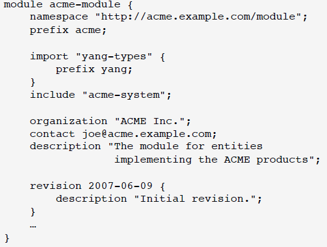

### submodule
submodule是部分模块定义，用于对模块提供支持。
submodule文件内容布局如下：
```
submodule <module-name> {
yang-version statement

 // module identification
belongs-to statement

 // linkage statements
import statements
include statements

 // meta information
organization statement
contact statement
description statement
reference statement

// revision history
revision statements

 // module definitions
other statements
}
```
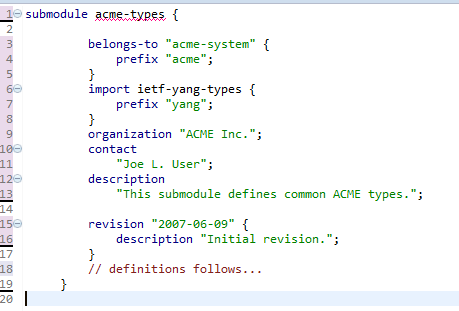

##### 注意：
submodule必须通过belongs-to语句使用， submodule只能由belong-to指定的module或这个指定module的其它submodule进行include，其它module(包括submodule)都不能include。同时子模块不可以import它的父模块

### namespace
module中必须定义所有节点都属于一个特定的XML命名空间，由一个URI指定命名空间。例如
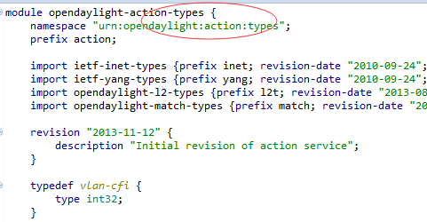

### Import revision
import或include语句包含一个revision-date的子句，所有引入的YANG定义来自要导入或引入的指定revision模块。通过引入特定的模块修订，我们可以独立发布演变中的模块。YANG提供了指定的规则，如何发布进化中的模块并且保持向后的兼容性。比如：
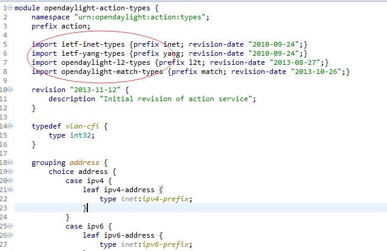

### YANG的数据类型

### 派生类型
YANG采用typedef语句来定义派生类型。例如以下是定义一个派生类型percent，限制类型是内建类型uint8：
```
typedef percent {
type uint8 {
range "0 .. 100";
}
}
再如定义一个ip-address类型，它包含了两个派生类型的联合：
typedef ip-address {
type union {
type ipv4-address;
type ipv6-address;
}
}
```

## 三、YANG数据节点
### leaf
leaf定义的节点只有一个值，是一个叶子节点，只能有一个实例。
例如：
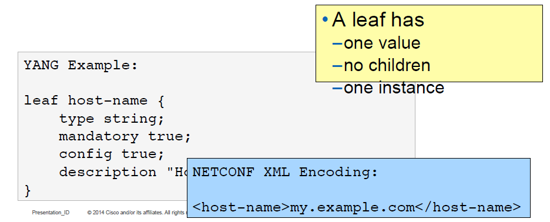
### leaf-list
leaf-list定义一组相同类型的叶节节点，类似数组。与leaf区别在于leaf只有一个实例，而leaf-list可以有多个实例。例如：
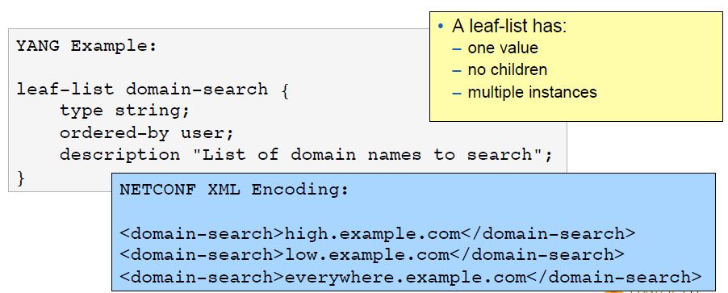

### container
container主要定义一个schema树的内部节点，它本身没有任何值和意义，只是作为一系列子节点的父亲存在，只有一个实例。例如：
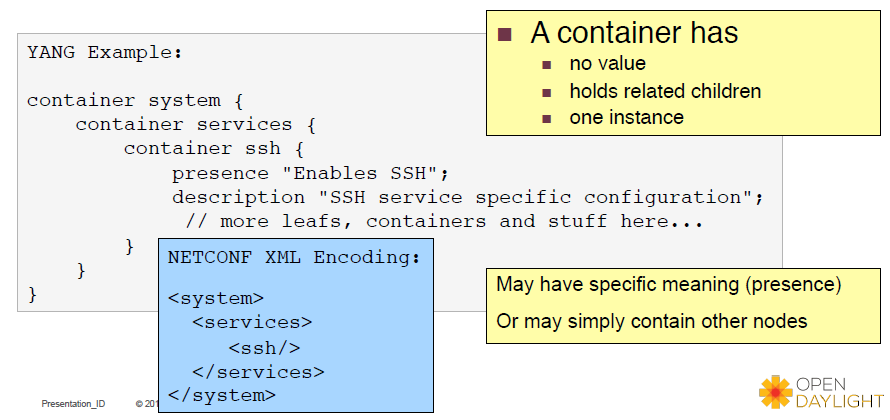

### list
list描述了一组节点的集合，它像一张数据库表一样，表的每一行用key来标识其主键，有多个实例。例如：
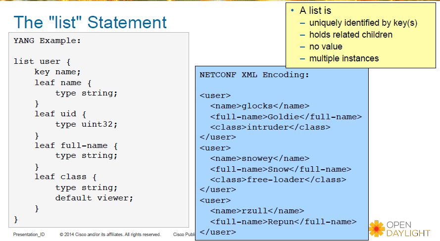
### grouping
一个grouping定义一个可以重复使用的节点集合，使用时通过use语句，并可通过refine语句进行改进。例如：
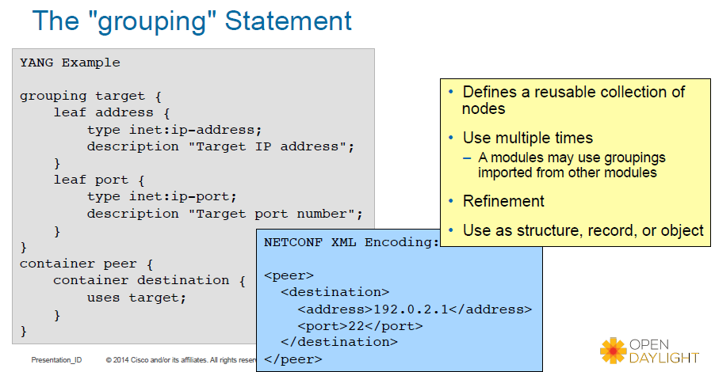
使用grouping时，通过use语句，它会将grouping定义的节点复制到当前的schema树(如果有refine，并进行更新)。

### choice
一个choice节点定义了一个可供选择项的集合，每一个选择项都会在某种情况下存在。一个choice由许多分枝，通过case子语句定义。比如
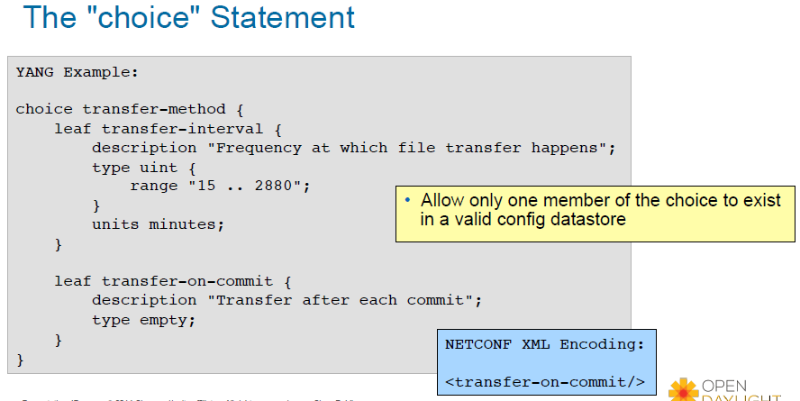
### anyxml
anyxml表示任何未知的数据定义。
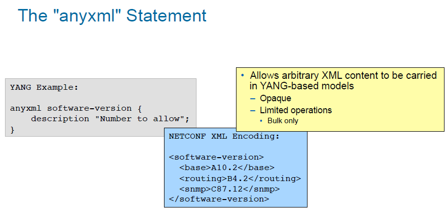
### augment
YANG提供augment语句，扩大一个模块层次，将节点添加到一个已存在的模块或子模块当中。目标结点可以是一个container, list, choice, case, rpc, input, output, notification等。

augment可以是条件的，使用when语句，当特定条件满足时，新节点才会出现。

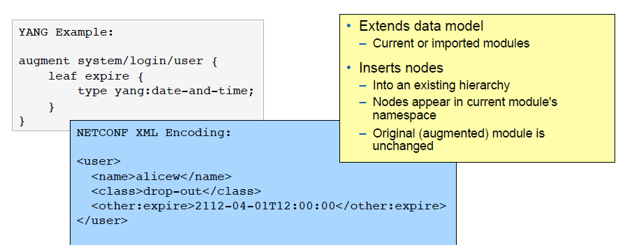

### notification
notification语句用来定义Notification内容，内容数据的定义同YANG数据定义一样。下面例子使用上文例子定义的connection。
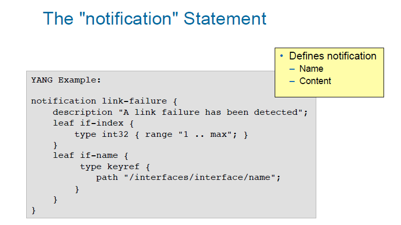

### rpc
rpc语句用来定义NETCONF协议的RPCs，input和output使用YANG数据定义语句。如下例子，建模一个激活软件图片的RPC：
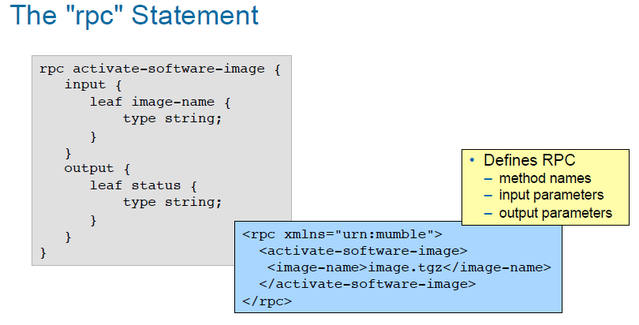
