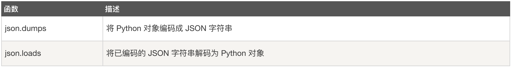
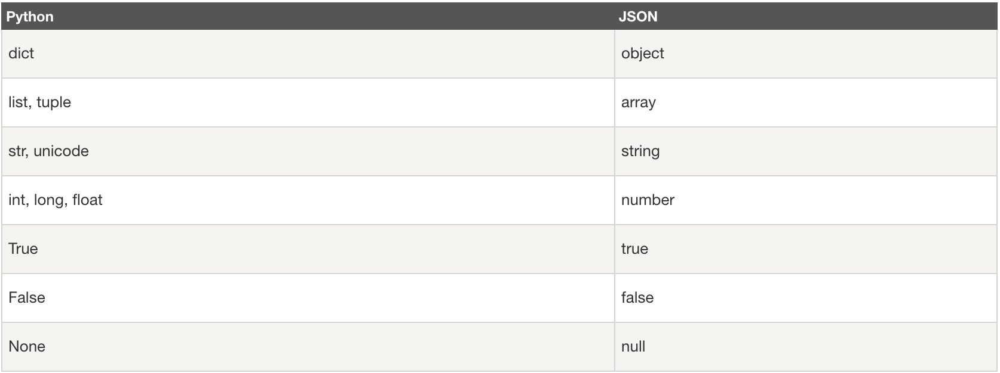
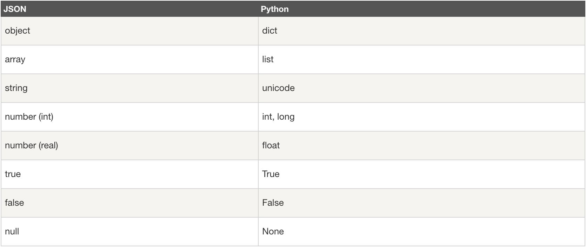

该笔记将记录如何在Python中编码和解码JSON对象

## 1、JSON函数:
使用 JSON 函数需要导入 json 库: import json。



&nbsp;

### 一、json.dumps
json.dumps 用于将 Python 对象编码成 JSON 字符串。

#### 1、语法
```
json.dumps(obj, skipkeys=False, ensure_ascii=True, check_circular=True, allow_nan=True, cls=None, indent=None, separators=None, encoding="utf-8", default=None, sort_keys=False, **kw)
```

#### 2、实例
以下实例将数组编码为 JSON 格式数据：

```python
#!/usr/bin/python
import json
data = [ { 'a' : 1, 'b' : 2, 'c' : 3, 'd' : 4, 'e' : 5 } ]
json = json.dumps(data)
print (json)
print(type(json))
print(type(data))

Result:
╭─soul@NetDevOps ~/Soul/DevNetGitHub/NetDevOps/JSON ‹master*›
╰─$ python3 test.py
[{"a": 1, "b": 2, "c": 3, "d": 4, "e": 5}]
<class 'str'>
<class 'list'>
```

```python
import json
print (json.dumps({'a': 'Runoob', 'b': 7}, sort_keys=True, indent=4, separators=(',', ': ')))

╭─soul@NetDevOps ~/Soul/DevNetGitHub/NetDevOps/JSON ‹master*›
╰─$ python3 test.py
{
    "a": "Runoob",
    "b": 7
}
```
#### 3、python 原始类型向 json 类型的转化对照表：


### 二、json.loads
json.loads 用于解码 JSON 数据。该函数返回 Python 字段的数据类型。
#### 1、语法
```
json.loads(s[, encoding[, cls[, object_hook[, parse_float[, parse_int[, parse_constant[, object_pairs_hook[, **kw]]]]]]]])
```
#### 2、实例
```python
#!/usr/bin/python
import json
jsonData = '{"a":1,"b":2,"c":3,"d":4,"e":5}';
text = json.loads(jsonData)
print (text)

Result:
╭─soul@NetDevOps ~/Soul/DevNetGitHub/NetDevOps/JSON ‹master*›
╰─$ python3 test.py
{'a': 1, 'b': 2, 'c': 3, 'd': 4, 'e': 5}
```

#### 3、json 类型转换到 python 的类型对照表：

